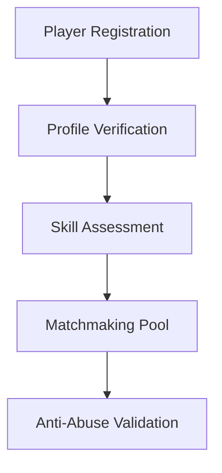
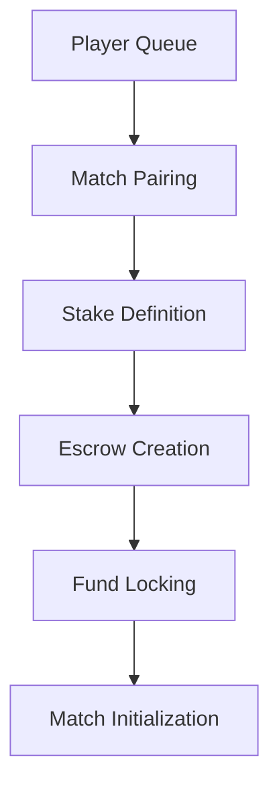
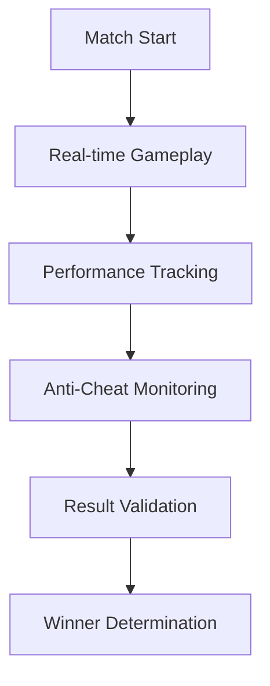
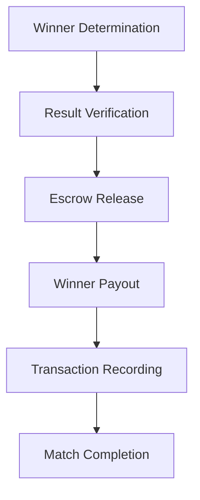

# Gaming Protocol Flow Analysis

**Note**: The original flow diagram URL had encoding issues. This analysis is based on the bounty description and typical gaming protocol architecture.

## Protocol Overview

The PrimeSkill Studio gaming protocol implements a **Win-2-Earn competitive FPS model** on Solana with the following core mechanics:

### High-Level Flow

```
Player Registration → Match Making → Token Staking → Game Execution → Winner Determination → Payout Distribution
```

## Detailed Component Analysis

### 1. Player Management System



**Key Functions:**
- Player account creation and verification
- Skill-based matchmaking
- Sybil attack prevention
- Fair play enforcement

**Security Considerations:**
- Account ownership validation
- Anti-bot mechanisms
- Identity verification
- Reputation system integrity

### 2. Matchmaking & Escrow System



**Critical Components:**
- **Match Pairing Algorithm**: Fair player matching
- **Stake Requirements**: Token amount validation
- **Escrow Contract**: Secure fund management
- **Timeout Mechanisms**: Handle incomplete matches

**Security Priorities:**
- Fund locking integrity
- Access control for escrow operations
- Proper timeout and refund logic
- Anti-manipulation protections

### 3. Game Execution Flow



**Key Elements:**
- Real-time game state management
- Anti-cheat system integration
- Performance metrics collection
- Fair result determination

**Audit Focus:**
- Game state validation
- Anti-manipulation mechanisms
- Result verification process
- Dispute resolution system

### 4. Payout & Settlement



**Critical Operations:**
- Automated winner verification
- Secure fund release from escrow
- Transaction execution and recording
- Fee distribution (if applicable)

**Security Requirements:**
- Tamper-proof result validation
- Secure escrow release mechanisms
- Protection against double-spending
- Proper access controls

## Smart Contract Architecture (Inferred)

### Core Contracts

#### 1. Player Registry Contract
```rust
// Pseudo-structure based on typical gaming protocols
pub struct PlayerRegistry {
    players: HashMap<Pubkey, PlayerProfile>,
    skill_ratings: HashMap<Pubkey, u32>,
    reputation_scores: HashMap<Pubkey, u32>,
}
```

#### 2. Matchmaking Contract
```rust
pub struct MatchmakingService {
    active_queues: Vec<MatchQueue>,
    match_history: HashMap<Pubkey, Vec<MatchResult>>,
    pairing_algorithm: PairingStrategy,
}
```

#### 3. Escrow Contract (CRITICAL)
```rust
pub struct GameEscrow {
    escrow_accounts: HashMap<Pubkey, EscrowAccount>,
    match_stakes: HashMap<MatchId, StakeInfo>,
    release_conditions: ReleaseRules,
}
```

#### 4. Game State Contract
```rust
pub struct GameState {
    active_matches: HashMap<MatchId, Match>,
    results: HashMap<MatchId, MatchResult>,
    anti_cheat_data: Vec<SecurityEvent>,
}
```

## Critical Security Vectors

### 1. Escrow Vulnerabilities
- **Re-entrancy attacks** in fund release
- **Unauthorized access** to escrow functions
- **Integer overflow/underflow** in stake calculations
- **Race conditions** in concurrent operations

### 2. Game Logic Exploits
- **Result manipulation** by malicious actors
- **State corruption** through invalid transitions
- **Timing attacks** on game mechanics
- **Collusion prevention** in player matching

### 3. Economic Attacks
- **Flash loan attacks** on staking mechanisms
- **Arbitrage exploitation** in payout calculations
- **Sybil attacks** through fake accounts
- **Market manipulation** via coordinated play

### 4. Platform-Specific Risks
- **Account validation bypass** in Solana
- **PDA manipulation** attacks
- **Cross-program invocation** vulnerabilities
- **Compute budget exhaustion** DoS attacks

## Audit Priority Matrix

| Component | Risk Level | Impact | Likelihood | Priority |
|-----------|------------|---------|------------|----------|
| Escrow System | Critical | High | Medium | 1 |
| Winner Determination | High | High | Low | 2 |
| Anti-Cheat System | High | Medium | Medium | 3 |
| Player Matching | Medium | Medium | Low | 4 |
| State Management | Medium | Low | Medium | 5 |

## Testing Strategy

### 1. Unit Tests
- Individual function validation
- Edge case handling
- Error condition testing
- Input validation checks

### 2. Integration Tests
- End-to-end game flow
- Multi-player scenarios
- Concurrent operation testing
- State persistence validation

### 3. Security Tests
- Attack vector simulations
- Privilege escalation attempts
- Economic attack scenarios
- Performance stress testing

### 4. Game Theory Analysis
- Incentive alignment validation
- Nash equilibrium analysis
- Collusion resistance testing
- Economic sustainability review

## Recommendations for Audit Focus

### Immediate Priorities
1. **Escrow contract security** - funds protection is paramount
2. **Access control validation** - prevent unauthorized operations
3. **Winner determination logic** - ensure fair and tamper-proof results
4. **Anti-abuse mechanisms** - validate effectiveness of fraud prevention

### Secondary Concerns
1. **Gas optimization** - reduce transaction costs
2. **User experience** - smooth game flow and error handling
3. **Scalability** - handle concurrent matches efficiently
4. **Monitoring** - comprehensive event logging for security

---

**Analysis Status**: Preliminary based on bounty description
**Next Steps**: Download source code for detailed technical analysis
**Updated**: September 18, 2025
**Analyst**: RECTOR

*This analysis will be refined once the actual source code and flow diagram are available.*